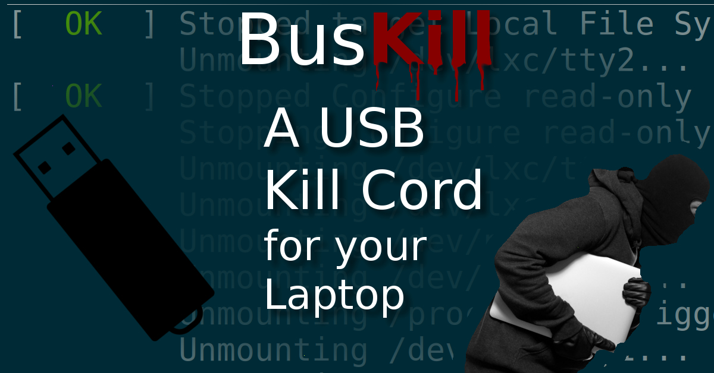

# BusKill App

This is the codebase for our cross-platform (CLI and) GUI app for [BusKill](https://www.buskill.in). It works in Linux, Windows, and MacOS.

BusKill is a laptop kill cord that can trigger your computer to lock or shutdown when it's physically seperated from you.

  

For more information on how to buy or build your own BusKill cable, see the [BusKill Website](https://www.buskill.in):

 * [https://www.buskill.in](https://www.buskill.in)

# Press

As seen on [PCMag](https://www.pcmag.com/news/372806/programmers-usb-cable-can-kill-laptop-if-machine-is-yanked), [Forbes](https://www.forbes.com/sites/daveywinder/2020/01/03/this-20-usb-cable-is-a-dead-mans-switch-for-your-linux-laptop/), [ZDNet](https://www.zdnet.com/article/new-usb-cable-kills-your-linux-laptop-if-stolen-in-a-public-place/), & [Tom's Hardware](https://www.tomshardware.com/news/the-buskill-usb-cable-secures-your-laptop-against-thieves).

# License

The contents of this repo are dual-licensed. All code is GPLv3 and all other content is CC-BY-SA.

# For more Information

See https://tech.michaelaltfield.net/2020/01/02/buskill-laptop-kill-cord-dead-man-switch/
