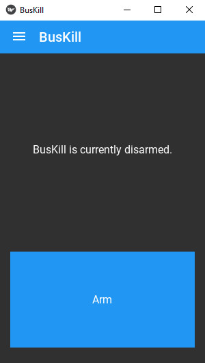

# BusKill App

This is the codebase for our cross-platform (CLI and) GUI app for [BusKill](https://www.buskill.in). It works in Linux, Windows, and MacOS.

# What is BusKill?

The quickest way to understand BusKill is to watch our 2-minute [BusKill Explainer Video](https://buskill.in/#demo).

|  |
|:--:| 
| *Watch the <a href="https://www.buskill.in/#demo">BusKill Explainer Video</a> for more info <a href="https://www.youtube.com/v/qPwyoD_cQR4">youtube.com/v/qPwyoD_cQR4</a>* |

BusKill is a laptop kill cord that can trigger your computer to lock or shutdown when it's physically separated from you.

| 

 |
|:--:| 
| *Watch the <a href="https://www.buskill.in/demo-2">BusKill Demo Video</a> to see the cable being used on Linux, Windows, and MacOS <a href="https://www.buskill.in/demo-2">buskill.in/demo-2</a>* |

For more information on how to [buy](https://www.buskill.in/buy) or build your own BusKill cable, see the [BusKill Website](https://www.buskill.in):

 * [https://www.buskill.in](https://www.buskill.in)

# Documentation

To read our comprehensive documentation, see:

 * [docs.buskill.in](https://docs.buskill.in)

## Install

For instructions on downloading and cryptographically verifying our latest release, see:

 * [Downloading the BusKill App](https://docs.buskill.in/buskill-app/en/stable/software_usr/download.html)
 * [Verifying the Download](https://docs.buskill.in/buskill-app/en/stable/software_usr/signature.html)

## Screenshots

BusKill is simple. When armed, a USB removal will trigger the screen to lock (by default).

BusKill runs in Linux, Windows, and MacOS.

  
  
  

For more information on how to use the GUI, see [BusKill App: Graphical User Interface](https://docs.buskill.in/buskill-app/en/stable/software_usr/gui.html)

## Misconceptions

> Q: Self-destruct?!? Will this brick my computer?

A: [No](https://docs.buskill.in/buskill-app/en/stable/faq.html#q-self-destruct-will-this-brick-my-computer). The BusKill app does not have the ability to harm your hardware and our app ships with non-destructive triggers only.

For more information, see our [Frequently Asked Questions](https://docs.buskill.in/buskill-app/en/stable/faq.html).

## Contributing

BusKill is an open-source project run by volunteers that create and maintain open-source hardware and software. Please see [Contributing to BusKill](https://docs.buskill.in/buskill-app/en/stable/contributing.html) to learn how you can help the BusKill project.

You can also [donate with bitcoin, monero, paypal, or credit card](https://buskill.in/donate).

Contributions of any amount and kind are greatly appreciated <3

## Attribution

Thank you to the countless [individuals and other open-source projects](https://docs.buskill.in/buskill-app/en/stable/attribution.html) that have contributed to to the BusKill project!

# Press

As seen on [PCMag](https://www.pcmag.com/news/372806/programmers-usb-cable-can-kill-laptop-if-machine-is-yanked), [Forbes](https://www.forbes.com/sites/daveywinder/2020/01/03/this-20-usb-cable-is-a-dead-mans-switch-for-your-linux-laptop/), [ZDNet](https://www.zdnet.com/article/new-usb-cable-kills-your-linux-laptop-if-stolen-in-a-public-place/), [Tom's Hardware](https://www.tomshardware.com/news/the-buskill-usb-cable-secures-your-laptop-against-thieves), [Tech Crunch](https://techcrunch.com/2021/12/16/buskill-kill-cord-self-destruct-laptop/), [PCWorld](https://www.pcworld.com/article/560619/this-usb-dead-mans-switch-cable-for-laptops-is-one-cat-tug-away-from-catastrophe.html), [Bleeping Computer](https://www.bleepingcomputer.com/news/security/buskill-cable-starts-a-self-destruct-routine-on-stolen-laptops/), [CoinDesk](https://www.coindesk.com/buskill-is-a-diy-tool-to-lock-down-your-laptop), [Heise](https://www.heise.de/news/BusKill-Sicherheitskabel-macht-Notebook-Datentraeger-unbrauchbar-6296117.html), [Golem](https://www.golem.de/news/buskill-magnetisches-kabel-dient-als-killswitch-fuer-notebooks-2112-161861.html), and [Korben](https://korben.info/un-cable-usb-pour-autodetruire-votre-ordinateur-sous-linux-sil-est-vole-voici-buskill.html).

# Contact

To contact us via email, please visit:

 * https://www.buskill.in/contact/

# License

Copyright (C) 2020-2022 Michael Altfield and the BusKill Team

The contents of this repo are under the GPL version 3 or later.
In addition, any content other than code can also be used, at your
choice, under CC-BY-SA version 4.0.

This program is free software: you can redistribute it and/or modify
it under the terms of the GNU General Public License as published by
the Free Software Foundation, either version 3 of the License, or
(at your option) any later version.

This program is distributed in the hope that it will be useful,
but WITHOUT ANY WARRANTY; without even the implied warranty of
MERCHANTABILITY or FITNESS FOR A PARTICULAR PURPOSE.  See the
GNU General Public License for more details.

You should have received a copy of the GNU General Public License
along with this program.  If not, see <http://www.gnu.org/licenses/>.

# For more Information

See https://tech.michaelaltfield.net/2020/01/02/buskill-laptop-kill-cord-dead-man-switch/
